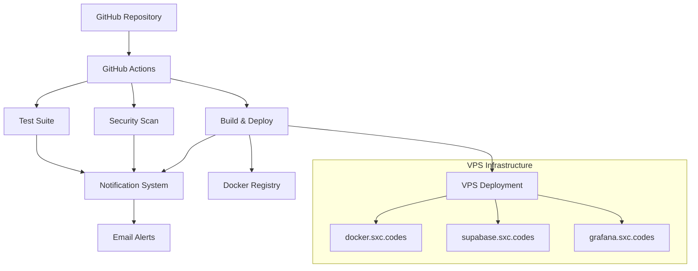

# AFL Fantasy Platform - CI/CD Setup Guide

## Overview

This document provides comprehensive instructions for setting up and configuring the CI/CD pipeline for the AFL Fantasy Platform. The system uses GitHub Actions for continuous integration and deployment, with email notifications for the Tiation team.

## 🏗️ Architecture Overview



## 📋 Prerequisites

### Required GitHub Secrets

Set up the following secrets in your GitHub repository settings:

1. **SMTP_USERNAME** - Gmail address for sending notifications
2. **SMTP_PASSWORD** - Gmail app password (not regular password)
3. **SEMGREP_APP_TOKEN** - Token for security scanning (optional)
4. **VPS_SSH_KEY** - SSH private key for VPS deployment (future use)

### Email Configuration

To enable email notifications, you'll need to:

1. **Create Gmail App Password:**
   ```bash
   # Go to Google Account Settings
   # Security → 2-Step Verification → App passwords
   # Generate password for "Mail"
   ```

2. **Configure SMTP Settings:**
   - Server: `smtp.gmail.com`
   - Port: `587`
   - Security: `TLS`

## 🚀 CI/CD Workflows

### 1. Main Deployment Pipeline (`.github/workflows/deploy.yml`)

**Triggers:**
- Push to `main` or `master` branch
- Pull requests
- Manual trigger
- Weekly security scan (Mondays 6 AM)

**Jobs:**
1. **Test Application**
   - Code linting
   - TypeScript compilation
   - Unit tests
   - API endpoint testing
   - AI integration testing (Gemini/OpenAI)
   - Build verification

2. **Security Analysis**
   - npm audit for vulnerabilities
   - Semgrep security scanning
   - Results uploaded as artifacts

3. **Build and Deploy**
   - Multi-platform Docker build
   - Push to GitHub Container Registry
   - Deploy to staging environment

4. **Notifications**
   - Send email alerts to team
   - Include pipeline status and links

### 2. Monitoring Pipeline (`.github/workflows/monitoring.yml`)

**Triggers:**
- Every 15 minutes
- Manual trigger
- Changes to monitoring configs

**Checks:**
- Application health endpoints
- Database connectivity
- External API dependencies (DFS Australia, Champion Data)
- AI service connectivity (Gemini, OpenAI)
- Performance metrics
- Security vulnerability scanning

**Alerting:**
- Critical alerts: Immediate notification
- Warning alerts: Standard notification
- Daily health reports

## 📧 Notification Configuration

### Email Recipients
- `tiatheone@protonmail.com`
- `garrett@sxc.codes`
- `garrett.dillman@gmail.com`

### Alert Types

1. **Success Notifications**
   - ✅ All tests passed
   - ✅ Security scan clean
   - ✅ Deployment successful

2. **Failure Notifications**
   - ❌ Test failures
   - ❌ Security vulnerabilities
   - ❌ Deployment issues

3. **Monitoring Alerts**
   - 🚨 Critical: Service down
   - ⚠️ Warning: Performance issues
   - 📊 Daily: Health reports

## 🔧 Setup Instructions

### Step 1: Configure Repository Secrets

1. Go to GitHub repository → Settings → Secrets and variables → Actions
2. Add the following secrets:

```bash
# Email configuration
SMTP_USERNAME=your-gmail@gmail.com
SMTP_PASSWORD=your-app-password

# Security scanning (optional)
SEMGREP_APP_TOKEN=your-semgrep-token
```

### Step 2: Verify Workflow Files

Ensure these files exist in `.github/workflows/`:
- `deploy.yml` - Main CI/CD pipeline
- `monitoring.yml` - Health checks and monitoring

### Step 3: Test the Pipeline

1. **Push a test commit:**
   ```bash
   git add .
   git commit -m "test: Trigger CI/CD pipeline"
   git push origin main
   ```

2. **Check GitHub Actions:**
   - Go to repository → Actions tab
   - Monitor workflow execution
   - Verify email notifications

### Step 4: Configure Monitoring

1. **Set up Prometheus/Grafana on VPS:**
   ```bash
   # On docker.sxc.codes (145.223.22.7)
   ssh root@145.223.22.7
   docker-compose -f monitoring/docker-compose.yml up -d
   ```

2. **Configure Alertmanager:**
   ```bash
   # Copy alertmanager config
   cp monitoring/alertmanager.yml /etc/alertmanager/
   ```

## 🏥 Health Monitoring

### VPS Infrastructure Monitoring

The monitoring system checks:

1. **docker.sxc.codes (145.223.22.7)**
   - Application containers
   - Resource usage
   - Docker daemon health

2. **supabase.sxc.codes (93.127.167.157)**
   - Database connectivity
   - Query performance
   - Backup status

3. **grafana.sxc.codes (153.92.214.1)**
   - Dashboard accessibility
   - Metrics collection
   - Alert status

### Alert Thresholds

```yaml
# Application alerts
- CPU Usage > 80% for 5 minutes
- Memory Usage > 90% for 5 minutes
- Response Time > 2 seconds
- Error Rate > 10%

# Infrastructure alerts
- Disk Space < 10%
- Database down > 2 minutes
- Service restart loop > 3 times/hour
```

## 🔒 Security Best Practices

### 1. Secrets Management
- Never commit secrets to repository
- Use GitHub Secrets for sensitive data
- Rotate secrets regularly
- Use least-privilege access

### 2. Code Security
- Automated dependency scanning
- Security linting with Semgrep
- Container vulnerability scanning
- Regular security updates

### 3. Infrastructure Security
- SSH key-based authentication
- VPS firewall configuration
- SSL/TLS encryption
- Regular security patches

## 🤖 AI Integration Testing

### Automated AI Service Testing

The CI/CD pipeline includes comprehensive testing for AI integrations:

1. **Gemini API Connectivity**
   ```bash
   # Test Gemini API connection
   npm run test:gemini-connection
   
   # Validate API key functionality
   npm run test:gemini-auth
   ```

2. **OpenAI Fallback Verification**
   ```bash
   # Test OpenAI fallback mechanism
   npm run test:openai-fallback
   
   # Verify fallback logic
   npm run test:ai-fallback-logic
   ```

3. **AI Function Testing**
   ```bash
   # Test specific AI functions
   npm run test:ai-trade-analysis
   npm run test:ai-captain-advice
   npm run test:ai-team-analysis
   ```

### Environment Variables for AI Testing

The following environment variables should be configured for testing:

```bash
# Required for production testing
GEMINI_API_KEY=test_gemini_key
OPENAI_API_KEY=test_openai_key

# Optional test configuration
AI_TEST_MODE=true
AI_TIMEOUT_MS=10000
AI_RETRY_COUNT=3
```

### AI Service Health Checks

Monitoring includes automated health checks for AI services:

```yaml
# AI service health check configuration
ai_health_checks:
  gemini:
    endpoint: "/api/ai/test-gemini"
    timeout: 30s
    interval: 5m
    expected_status: 200
  
  openai_fallback:
    endpoint: "/api/ai/test-fallback"
    timeout: 30s
    interval: 5m
    expected_status: 200
```

### AI Testing Best Practices

1. **Rate Limit Awareness**
   - Implement proper rate limiting in tests
   - Use mock responses for unit tests
   - Reserve API calls for integration tests

2. **Fallback Testing**
   - Test Gemini failure scenarios
   - Verify OpenAI fallback activation
   - Ensure graceful error handling

3. **Response Validation**
   - Validate AI response structure
   - Check response content quality
   - Verify error message handling

### AI Test Coverage Metrics

Target coverage for AI integration:
- **API Connectivity**: 100%
- **Fallback Logic**: 100%
- **Error Handling**: 95%
- **Response Validation**: 90%

---

## 🛠️ Troubleshooting

### Common Issues

1. **Email notifications not working**
   ```bash
   # Check SMTP credentials
   # Verify Gmail app password
   # Check GitHub secrets configuration
   ```

2. **Pipeline failures**
   ```bash
   # Check GitHub Actions logs
   # Verify Node.js version compatibility
   # Check dependency conflicts
   ```

3. **Deployment issues**
   ```bash
   # SSH to VPS and check logs
   ssh root@145.223.22.7
   docker logs afl-fantasy-app
   ```

### Recovery Procedures

1. **Service Down**
   ```bash
   # Restart containers
   docker-compose restart
   
   # Check system resources
   df -h && free -h
   
   # Review recent logs
   docker logs --tail=100 afl-fantasy-app
   ```

2. **Database Issues**
   ```bash
   # Connect to database server
   ssh root@93.127.167.157
   
   # Check Supabase status
   docker ps | grep supabase
   
   # Test connectivity
   psql -h localhost -U postgres -d afl_fantasy
   ```

## 📊 Monitoring Dashboards

### Grafana Dashboards

Access monitoring dashboards at: https://grafana.sxc.codes

**Key Metrics:**
- Application response times
- Error rates and status codes
- Database query performance
- Infrastructure resource usage
- Security alert status

### Prometheus Queries

Common monitoring queries:
```promql
# Application response time
histogram_quantile(0.95, rate(http_request_duration_seconds_bucket[5m]))

# Error rate
rate(http_requests_total{status=~"5.."}[5m])

# CPU usage
rate(container_cpu_usage_seconds_total[5m]) * 100

# Memory usage
container_memory_usage_bytes / container_spec_memory_limit_bytes * 100
```

## 🔄 Maintenance

### Regular Tasks

1. **Weekly:**
   - Review security scan results
   - Check system resource usage
   - Verify backup integrity

2. **Monthly:**
   - Update dependencies
   - Review alert thresholds
   - Performance optimization

3. **Quarterly:**
   - Security audit
   - Infrastructure review
   - Disaster recovery testing

### Backup Strategy

```bash
# Database backups
docker exec postgres pg_dump -U postgres afl_fantasy > backup_$(date +%Y%m%d).sql

# Application data
tar -czf app_backup_$(date +%Y%m%d).tar.gz /app/data

# Configuration backups
tar -czf config_backup_$(date +%Y%m%d).tar.gz /etc/prometheus /etc/grafana
```

## 📞 Support & Contacts

### Emergency Response Team
- **Primary:** tiatheone@protonmail.com
- **Secondary:** garrett@sxc.codes
- **Tertiary:** garrett.dillman@gmail.com

### Infrastructure Access
- **Docker Host:** ssh root@145.223.22.7
- **Database:** ssh root@93.127.167.157
- **Monitoring:** ssh root@153.92.214.1

### Documentation
- [API Documentation](./api.md)
- [Deployment Guide](./DEPLOYMENT_VERIFICATION.md)
- [Security Guidelines](./SECURITY_DEVOPS.md)

---

*This CI/CD system is maintained by **Tiation** following enterprise-grade DevOps standards and best practices.*
