# 🔄 AFL Fantasy iOS: Data Flow Architecture Diagram

> **Visual System Architecture & Data Pipeline Documentation**
> *Last Updated: September 6, 2025*

---

## 🏗️ **System Architecture Overview**


---

## 📊 **Detailed Component Data Flow**

### **1. Data Ingestion Pipeline**


### **2. Real-Time UI Updates**


### **3. Feature-Specific Data Flows**

#### **Dashboard Data Flow:**
```
External Sources → Scrapers → main.py → JSON → AFL Fantasy API → AppState → SimpleDashboardView
```

#### **Captain Advisor Data Flow:**
```
Player Data → AI Tools → Captain Analysis → Captain API → AppState → SimpleCaptainView
```

#### **Cash Cow Tracker Data Flow:**
```
Price Data → Cash Tools → Price Projections → Cash API → AppState → SimpleCashCowView
```

#### **Trade Calculator Data Flow:**
```
Player Prices → Trade Tools → Trade Analysis → Trade API → AppState → SimpleTradeCalculatorView
```

---

## 🔧 **API Endpoint Architecture**

### **Core AFL Fantasy Endpoints**

| **Endpoint** | **Backend Service** | **UI Consumer** | **Update Frequency** |
|-------------|-------------------|-----------------|-------------------|
| `/api/afl-fantasy/dashboard-data` | AFL Fantasy Data Service | Dashboard View | Real-time |
| `/api/afl-fantasy/team-value` | Cash Tools Service | Team Value Display | 5-minute cache |
| `/api/afl-fantasy/team-score` | Score Calculator | Score Header | Live updates |
| `/api/afl-fantasy/rank` | Rank Tracker | Rank Display | Daily |
| `/api/afl-fantasy/captain` | Captain Service | Captain View | Hourly |

### **Analytics Tool Endpoints**

| **Tool Category** | **Endpoint Pattern** | **Backend Implementation** | **iOS Integration** |
|-------------------|---------------------|---------------------------|-------------------|
| **Trade Analysis** | `/api/trade/*` | TypeScript + Python | Trade Calculator UI |
| **Cash Generation** | `/api/cash/*` | Python Cash Tools | Cash Cow Tracker |
| **Risk Assessment** | `/api/risk/*` | Python Risk Tools | Alert System |
| **AI Analysis** | `/api/ai/*` | Python AI Tools | AI Advisor Views |

---

## 🚀 **Performance Optimization Architecture**

### **Caching Strategy**

```mermaid
graph LR
    subgraph "📱 iOS App"
        MEM[Memory Cache]
        LOCAL[Local Storage]
    end
    
    subgraph "🔄 API Layer"
        REDIS[(Redis Cache)]
        API[API Server]
    end
    
    subgraph "🐍 Backend"
        JSON[JSON Files]
        DB[(PostgreSQL)]
    end

    MEM --> LOCAL
    LOCAL --> REDIS
    REDIS --> API
    API --> JSON
    JSON --> DB

    MEM -.->|"Immediate"| MEM
    LOCAL -.->|"< 100ms"| LOCAL
    REDIS -.->|"< 200ms"| REDIS
    API -.->|"< 500ms"| API
    JSON -.->|"< 1s"| JSON
    DB -.->|"< 2s"| DB
```



### **Data Synchronization Strategy**

| **Data Type** | **Sync Method** | **Frequency** | **Fallback Strategy** |
|---------------|----------------|---------------|---------------------|
| **Player Stats** | Scheduled scraping | Every 12 hours | Cached previous version |
| **Team Scores** | Real-time API | Live updates | 5-minute stale data |
| **Price Changes** | Calculated updates | Hourly | Last known prices |
| **Fixtures** | Weekly scraping | Weekly | Static fixture list |

---

## 🔐 **Security Architecture**

### **Authentication & Authorization Flow**


### **Data Protection Measures**

| **Layer** | **Protection Method** | **Implementation** |
|-----------|---------------------|-------------------|
| **Transport** | TLS 1.3 encryption | HTTPS everywhere |
| **Storage** | Keychain encryption | iOS secure enclave |
| **API Keys** | Environment variables | Docker secrets |
| **Session Management** | Secure cookies | HTTPOnly + Secure flags |
| **Database** | Encryption at rest | PostgreSQL encryption |

---

## 📈 **Monitoring & Observability**

### **Performance Metrics Architecture**

```mermaid
graph TB
    subgraph "📱 iOS Metrics"
        COLD[Cold Start Time]
        MEM[Memory Usage]
        CPU[CPU Usage]
        NET[Network Latency]
    end
    
    subgraph "🔄 API Metrics"
        RPS[Requests/Second]
        LAT[Response Latency]
        ERR[Error Rate]
        CACHE[Cache Hit Rate]
    end
    
    subgraph "🐍 Backend Metrics"
        SCRAPE[Scraping Success]
        PROC[Processing Time]
        DATA[Data Quality]
        UPTIME[Service Uptime]
    end
    
    subgraph "📊 Monitoring Stack"
        PROM[Prometheus]
        GRAF[Grafana]
        ALERTS[Alert Manager]
    end

    COLD --> PROM
    MEM --> PROM
    CPU --> PROM
    NET --> PROM
    
    RPS --> PROM
    LAT --> PROM
    ERR --> PROM
    CACHE --> PROM
    
    SCRAPE --> PROM
    PROC --> PROM
    DATA --> PROM
    UPTIME --> PROM
    
    PROM --> GRAF
    PROM --> ALERTS
```



### **Health Check Endpoints**

| **Service** | **Health Check** | **Success Criteria** | **Failure Actions** |
|-------------|-----------------|---------------------|-------------------|
| **API Server** | `/api/health` | 200 OK + service status | Container restart |
| **Python Service** | `/health` | Data freshness check | Scraper restart |
| **Database** | `pg_isready` | Connection successful | Database recovery |
| **Redis** | `redis-cli ping` | PONG response | Cache clear + restart |

---

## 🎯 **Development & Deployment Flow**

### **CI/CD Pipeline Architecture**

```mermaid
graph LR
    subgraph "👩‍💻 Development"
        DEV[Local Development]
        COMMIT[Git Commit]
    end
    
    subgraph "🔄 CI Pipeline"
        BUILD[Build & Test]
        LINT[Lint & Format]
        SEC[Security Scan]
    end
    
    subgraph "🚀 Deployment"
        STAGE[Staging Deploy]
        PROD[Production Deploy]
        MON[Monitoring]
    end

    DEV --> COMMIT
    COMMIT --> BUILD
    BUILD --> LINT
    LINT --> SEC
    SEC --> STAGE
    STAGE --> PROD
    PROD --> MON
    MON -.->|"Feedback"| DEV
```



---

## 🏆 **Architecture Benefits**

### **Scalability Features**
- **Horizontal Scaling**: Container-based microservices
- **Database Sharding**: Player data partitioned by team
- **CDN Integration**: Static assets cached globally
- **Load Balancing**: Nginx with health checks

### **Reliability Features**
- **Data Redundancy**: Multiple scraping sources
- **Graceful Degradation**: Fallback to cached data
- **Circuit Breakers**: API failure protection
- **Health Monitoring**: Proactive issue detection

### **Performance Features**
- **Multi-layer Caching**: Memory → Redis → Database
- **Background Processing**: Non-blocking data updates
- **Optimized Queries**: Database indexing strategy
- **Lazy Loading**: UI components load on demand

---

*This architecture documentation provides a complete visual and technical reference for understanding the AFL Fantasy iOS app's data flow, from external sources through backend processing to iOS UI rendering.*
