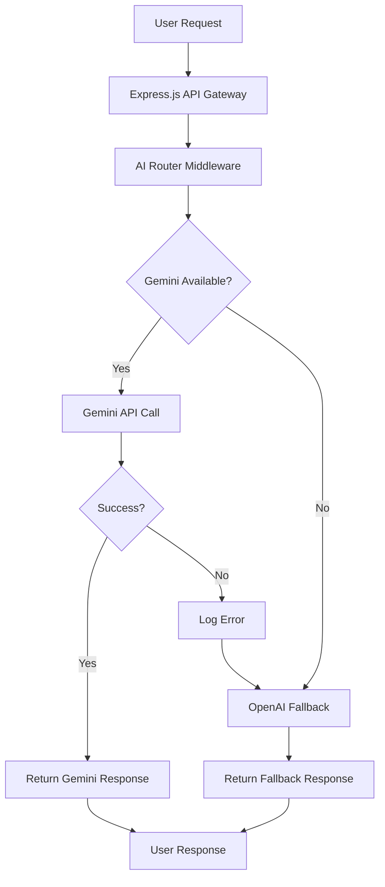

# Google Gemini AI Integration Guide

## Overview

This document provides comprehensive guidance for implementing and maintaining the Google Gemini AI integration within the AFL Fantasy Platform. The integration provides enhanced AI-powered analytics with intelligent fallback mechanisms to ensure continuous service availability.

## 🏗️ Architecture Overview



## 🔑 Environment Configuration

### Required Environment Variables

```bash
# Primary AI Service
GEMINI_API_KEY=your_google_gemini_api_key_here

# Fallback AI Service (Optional but Recommended)
OPENAI_API_KEY=your_openai_api_key_here

# Optional Configuration
GEMINI_MODEL=gemini-1.5-flash
GEMINI_TIMEOUT_MS=30000
GEMINI_MAX_RETRIES=3
```

### Production Environment Setup

#### Docker Configuration
```dockerfile
# Dockerfile
ENV GEMINI_API_KEY=${GEMINI_API_KEY}
ENV OPENAI_API_KEY=${OPENAI_API_KEY}
ENV GEMINI_MODEL=gemini-1.5-flash
ENV NODE_ENV=production
```

#### Kubernetes Deployment
```yaml
# k8s/deployment.yaml
apiVersion: apps/v1
kind: Deployment
metadata:
  name: afl-fantasy-app
spec:
  template:
    spec:
      containers:
      - name: app
        image: ghcr.io/tiation/afl-fantasy:latest
        env:
        - name: GEMINI_API_KEY
          valueFrom:
            secretKeyRef:
              name: afl-fantasy-secrets
              key: GEMINI_API_KEY
        - name: OPENAI_API_KEY
          valueFrom:
            secretKeyRef:
              name: afl-fantasy-secrets
              key: OPENAI_API_KEY
```

#### Kubernetes Secrets
```yaml
# k8s/secrets.yaml
apiVersion: v1
kind: Secret
metadata:
  name: afl-fantasy-secrets
  namespace: afl-fantasy
type: Opaque
stringData:
  GEMINI_API_KEY: "your-actual-gemini-api-key"
  OPENAI_API_KEY: "your-actual-openai-api-key"
```

## 🚀 Integration Features

### Core AI Functions with Gemini Integration

| **Function** | **Gemini Implementation** | **Fallback** | **Description** |
|--------------|---------------------------|---------------|-----------------|
| Trade Analysis | `get_gemini_trade_analysis` | `ai_trade_suggester` | AI-powered trade recommendations |
| Captain Selection | `get_gemini_captain_advice` | `ai_captain_advisor` | Intelligent captaincy suggestions |
| Team Structure | `get_gemini_team_analysis` | `team_structure_analyzer` | Team composition optimization |
| Breakout Predictions | `get_gemini_breakout_predictions` | *Gemini-only* | Advanced player breakout analysis |
| Injury Analysis | `get_gemini_injury_analysis` | *Gemini-only* | Fantasy impact of injuries |

### Gemini-Only Features

These advanced features are exclusively available through Gemini AI:

1. **Advanced Breakout Predictions**
   - Identifies potential breakout players
   - Analyzes role changes and opportunities
   - Provides probability scoring

2. **Injury Impact Assessment**
   - Evaluates fantasy impact of injuries
   - Identifies replacement opportunities
   - Provides timeline predictions

## 🔄 Fallback Logic Implementation

### 5-Step Fallback Mechanism

The platform implements a robust fallback system:

```typescript
async function executeAIToolWithFallback(
  geminiFunction: string,
  fallbackFunction: string,
  params?: any
): Promise<any> {
  try {
    // Step 1: API Key Validation
    if (!process.env.GEMINI_API_KEY) {
      console.log('Gemini API key not configured, falling back to OpenAI');
      return await executeOpenAITool(fallbackFunction);
    }
    
    // Step 2: Module Verification
    if (!fs.existsSync('backend/python/tools/gemini_tools.py')) {
      console.log('Gemini tools module not found, falling back to OpenAI');
      return await executeOpenAITool(fallbackFunction);
    }
    
    // Step 3: Primary API Call
    console.log(`Attempting to use Gemini for ${geminiFunction}`);
    const result = await callGeminiAPI(geminiFunction, params);
    
    if (result.status === 'success') {
      console.log(`Successfully used Gemini for ${geminiFunction}`);
      return result;
    }
    
    // Step 4: Automatic Fallback
    console.log(`Gemini request failed for ${geminiFunction}, falling back to OpenAI`);
    return await executeOpenAITool(fallbackFunction);
    
  } catch (error) {
    // Step 5: Error Logging
    console.error(`Error in executeAIToolWithFallback for ${geminiFunction}:`, error);
    
    try {
      return await executeOpenAITool(fallbackFunction);
    } catch (fallbackError) {
      return {
        status: 'error',
        message: 'Both Gemini and fallback methods failed',
        error: String(error)
      };
    }
  }
}
```

### Fallback Scenarios

1. **API Key Missing**: Immediate fallback to OpenAI
2. **Module Not Found**: Fallback with logging
3. **API Rate Limiting**: Automatic retry with fallback
4. **Network Timeout**: Fallback after timeout
5. **Invalid Response**: Response validation with fallback

## 🧪 Testing and Validation

### Health Check Endpoints

```typescript
// Test Gemini connectivity
GET /api/ai/test-gemini

// Response format
{
  "status": "success",
  "message": "Gemini API connection successful",
  "model": "gemini-1.5-flash",
  "response_time_ms": 1250,
  "fallback_available": true
}
```

### Integration Tests

```bash
# Run Gemini integration tests
npm run test:gemini-integration

# Test fallback mechanisms
npm run test:ai-fallback

# Test specific AI functions
npm run test:ai-trade-analysis
npm run test:ai-captain-advice
npm run test:ai-team-analysis
```

### Test Coverage Requirements

- **API Connectivity**: 100%
- **Fallback Logic**: 100%
- **Error Handling**: 95%
- **Response Validation**: 90%

## 📊 Monitoring and Observability

### Key Metrics to Monitor

```yaml
# Prometheus metrics configuration
ai_service_metrics:
  - name: gemini_api_requests_total
    type: counter
    help: "Total Gemini API requests"
    
  - name: gemini_api_success_rate
    type: gauge
    help: "Gemini API success rate percentage"
    
  - name: gemini_api_response_time
    type: histogram
    help: "Gemini API response time in seconds"
    
  - name: ai_fallback_activations_total
    type: counter
    help: "Total fallback activations"
```

### Grafana Dashboard Queries

```promql
# Gemini API success rate
rate(gemini_api_requests_total{status="success"}[5m]) / rate(gemini_api_requests_total[5m]) * 100

# Average response time
histogram_quantile(0.95, rate(gemini_api_response_time_bucket[5m]))

# Fallback activation rate
rate(ai_fallback_activations_total[5m])
```

### Alert Configuration

```yaml
# Alertmanager rules
groups:
  - name: ai_service_alerts
    rules:
      - alert: GeminiAPIHighFailureRate
        expr: rate(gemini_api_requests_total{status="error"}[5m]) > 0.1
        for: 2m
        labels:
          severity: warning
        annotations:
          summary: "High Gemini API failure rate detected"
          
      - alert: GeminiAPIDown
        expr: up{job="gemini-api"} == 0
        for: 1m
        labels:
          severity: critical
        annotations:
          summary: "Gemini API is down"
```

## 🔒 Security Best Practices

### API Key Management

1. **Never commit API keys to version control**
2. **Use environment variables or secret management systems**
3. **Rotate API keys regularly (quarterly)**
4. **Implement least-privilege access**
5. **Monitor API key usage and alerts**

### Request Security

```python
# Example secure API request implementation
class GeminiTools:
    def __init__(self):
        self.api_key = os.getenv('GEMINI_API_KEY')
        if not self.api_key:
            raise GeminiAPIError("API key not configured")
        
        # Implement rate limiting
        self.rate_limiter = RateLimiter(max_calls=60, period=60)
        
        # Set request timeout
        self.timeout = 30
    
    def _make_request(self, prompt: str) -> Dict[str, Any]:
        # Apply rate limiting
        self.rate_limiter.acquire()
        
        # Sanitize input
        prompt = self._sanitize_input(prompt)
        
        # Make secure request
        response = requests.post(
            f"{self.base_url}/models/{self.model_name}:generateContent",
            headers={"Content-Type": "application/json"},
            json=self._build_payload(prompt),
            timeout=self.timeout,
            params={"key": self.api_key}
        )
        
        return self._process_response(response)
```

## 🚨 Error Handling and Recovery

### Common Error Scenarios

1. **API Rate Limiting**
   ```python
   if response.status_code == 429:
       # Implement exponential backoff
       time.sleep(2 ** retry_count)
       return self._retry_request(prompt, retry_count + 1)
   ```

2. **Invalid API Key**
   ```python
   if response.status_code == 401:
       raise GeminiAPIError("Invalid API key - check GEMINI_API_KEY")
   ```

3. **Network Timeout**
   ```python
   except requests.exceptions.Timeout:
       logger.warning("Gemini API timeout, falling back to OpenAI")
       return self._fallback_to_openai(prompt)
   ```

### Recovery Procedures

1. **Immediate Recovery**
   - Automatic fallback to OpenAI
   - Error logging with context
   - User notification (optional)

2. **Investigation Steps**
   ```bash
   # Check API key validity
   curl -H "Authorization: Bearer $GEMINI_API_KEY" \
        "https://generativelanguage.googleapis.com/v1beta/models"
   
   # Review application logs
   kubectl logs -l app=afl-fantasy --tail=100
   
   # Check monitoring dashboards
   # Visit https://grafana.sxc.codes
   ```

## 📈 Performance Optimization

### Response Caching

```typescript
// Implement response caching for repeated requests
const cache = new NodeCache({ stdTTL: 300 }); // 5-minute cache

async function getCachedGeminiResponse(prompt: string, cacheKey: string) {
  const cached = cache.get(cacheKey);
  if (cached) {
    return cached;
  }
  
  const response = await geminiAPI.generateContent(prompt);
  cache.set(cacheKey, response);
  return response;
}
```

### Request Optimization

1. **Batch Requests**: Combine multiple related queries
2. **Prompt Optimization**: Use concise, specific prompts
3. **Response Limits**: Set appropriate token limits
4. **Parallel Processing**: Use async/await patterns

## 🔄 Maintenance and Updates

### Regular Maintenance Tasks

#### Weekly
- [ ] Review API usage metrics
- [ ] Check error rates and logs
- [ ] Verify fallback functionality

#### Monthly
- [ ] Update dependencies
- [ ] Review and optimize prompts
- [ ] Performance analysis

#### Quarterly
- [ ] Rotate API keys
- [ ] Security audit
- [ ] Update integration tests

### Update Procedures

```bash
# Update Gemini integration
git checkout -b feature/gemini-updates

# Update dependencies
npm update @google/generative-ai

# Run integration tests
npm run test:gemini-integration

# Deploy to staging
npm run deploy:staging

# Verify functionality
npm run test:e2e

# Deploy to production
npm run deploy:production
```

## 📞 Support and Troubleshooting

### Troubleshooting Checklist

1. **Check Environment Variables**
   ```bash
   echo $GEMINI_API_KEY
   echo $OPENAI_API_KEY
   ```

2. **Verify Module Existence**
   ```bash
   ls -la backend/python/tools/gemini_tools.py
   ```

3. **Test API Connectivity**
   ```bash
   curl -X GET http://localhost:5173/api/ai/test-gemini
   ```

4. **Review Application Logs**
   ```bash
   docker logs afl-fantasy-app --tail=50
   ```

### Common Issues and Solutions

| **Issue** | **Symptom** | **Solution** |
|-----------|-------------|--------------|
| API Key Invalid | 401 Unauthorized | Verify and update GEMINI_API_KEY |
| Rate Limiting | 429 Too Many Requests | Implement exponential backoff |
| Network Timeout | Connection timeout | Check network connectivity |
| Module Missing | ImportError | Verify gemini_tools.py exists |
| Fallback Failing | Both AI services down | Check OpenAI configuration |

### Emergency Contacts

- **Primary Support**: tiatheone@protonmail.com
- **DevOps Engineer**: garrett@sxc.codes
- **System Administrator**: garrett.dillman@gmail.com

### Related Documentation

- [Main README](../README.md)
- [Security & DevOps Guide](./SECURITY_DEVOPS.md)
- [CI/CD Setup Guide](./CICD_SETUP.md)
- [API Documentation](./api.md)

---

*This Gemini integration is maintained by **Tiation Technologies** following enterprise-grade AI integration best practices and security standards.*
