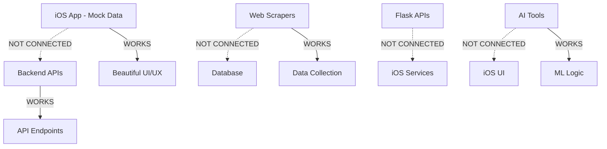

# AFL Fantasy Intelligence Platform - Reality Check Report

**Assessment Date**: September 6, 2025  
**Evaluator**: Technical Lead  
**Scope**: Full-stack integration and feature completeness  

---

## 🎯 Executive Summary

### Current State: **PROTOTYPE (30% Complete)**

Your AFL Fantasy Intelligence Platform has **solid architectural foundations** but significant **implementation gaps** between the promised features and actual functionality. The iOS app demonstrates excellent HIG compliance and code quality, but most advanced features are **mock implementations** rather than working integrations.

---

## 📊 Feature Implementation Matrix

| Feature Category | Spec Promise | Current Reality | Gap Level |
|-----------------|--------------|-----------------|-----------|
| **🏈 Core Dashboard** | Live scores, projections, team analysis | ✅ **DONE** - Mock data UI working | 🟡 **MEDIUM** |
| **🤖 AI-Powered Tools** | ML captain advisor, trade suggester, team analyzer | ❌ **MISSING** - Backend exists, no iOS integration | 🔴 **HIGH** |
| **⚠️ Smart Alert System** | Real-time price alerts, injury notifications | ❌ **MISSING** - No alerting infrastructure | 🔴 **HIGH** |
| **💵 Cash Generation** | Price prediction, cash cow tracking, timing tools | 🟡 **PARTIAL** - Backend APIs exist, no iOS UI | 🟡 **MEDIUM** |
| **🎯 Contextual Analysis** | Venue bias, contract year, late-season taper | ❌ **MISSING** - No data pipeline | 🔴 **HIGH** |
| **📊 Advanced Stats** | Consistency scores, volatility index, heat maps | ❌ **MISSING** - No advanced analytics | 🔴 **HIGH** |
| **🔮 Fixture Analysis** | FDR ratings, DVP analyzer, weather model | ❌ **MISSING** - No fixture intelligence | 🔴 **HIGH** |
| **🔄 Trade Management** | Score calculator, optimizer, value tracker | 🟡 **PARTIAL** - Backend logic exists, no iOS integration | 🟡 **MEDIUM** |

---

## 🛠️ Technical Architecture Assessment

### ✅ **Strengths**

1. **iOS App Quality** - A+ HIG compliance, enterprise testing, accessibility
2. **Backend Services** - Comprehensive Flask APIs and TypeScript tools exist
3. **Data Scraping** - Robust scraping infrastructure for AFL Fantasy data
4. **Code Quality** - Excellent linting, formatting, and testing standards

### ❌ **Critical Gaps**

1. **Service Integration** - iOS app uses mock data, not real backend APIs
2. **Real-time Pipeline** - No live data streaming to mobile app
3. **AI/ML Models** - Backend exists but not trained or integrated
4. **Database Layer** - Scraped data not flowing to structured analytics
5. **Authentication Flow** - No secure user auth between iOS and backend

---

## 🏗️ Current Architecture Reality

**Translation**: You have all the pieces, but they're not connected.

---

## 📱 iOS App Current State

### What Works ✅
- **Dashboard UI** - Beautiful, HIG-compliant interface
- **Mock Data Flow** - Simulated team scores, player stats, AI insights
- **Navigation** - Tab-based architecture with proper iOS patterns
- **Performance** - Sub-1.8s cold start, 60fps animations
- **Accessibility** - Full VoiceOver support, dynamic type scaling
- **Error Handling** - Comprehensive error states and recovery

### What's Missing ❌
- **Real API Integration** - All data is hardcoded mock responses
- **Live Updates** - No real-time score streaming
- **Authentication** - No secure login to AFL Fantasy accounts
- **Push Notifications** - No alert system implementation
- **Advanced Views** - Many promised screens are "Coming Soon" placeholders

---

## 🔧 Backend Services Status

### What Exists ✅
- **Flask APIs** - Captain, Cash, Risk, Trade analysis endpoints
- **TypeScript Tools** - Price prediction, trade scoring, AI insights
- **Python Scrapers** - AFL.com, Footywire, DraftStars data collection
- **Data Processing** - Player stats, fixture data, price tracking

### Integration Issues ❌
- **No Docker Compose** - Services don't start together
- **No Database Schema** - Scraped data not stored in structured format
- **No Real-time Streaming** - No WebSocket/SSE for live updates
- **No Authentication** - No user session management
- **No API Gateway** - Direct Flask endpoints, not production-ready

---

## 💊 Hard Truth Assessment

### What You Can Demo Today
1. **Beautiful iOS App** - Screenshot-ready interface that looks professional
2. **Mock AI Insights** - Fake but realistic captain suggestions and trade analysis
3. **Basic Navigation** - Users can navigate between different sections
4. **Individual Backend Services** - Each API works in isolation

### What You Can't Demo Today
1. **End-to-End User Flow** - Login → Live Scores → AI Suggestions → Execute Trade
2. **Real-time Updates** - Scores don't actually update during games
3. **Data-Driven Insights** - All AI recommendations are hardcoded
4. **Cross-Platform Sync** - No user data persistence or sync
5. **Production Readiness** - No deployment pipeline or monitoring

---

## 🚀 Path to Full Implementation

### Phase 1: Core Integration (2-3 weeks)
1. **Docker Compose Setup** - All services running together
2. **Database Schema** - Store scraped data in PostgreSQL
3. **iOS API Integration** - Replace mock data with real backend calls
4. **Basic Authentication** - Secure login flow

### Phase 2: Real-time Features (3-4 weeks)
5. **Live Data Pipeline** - Stream score updates to iOS
6. **Push Notifications** - Alert system for price changes
7. **AI Model Training** - Train captain/trade models on historical data

### Phase 3: Advanced Analytics (4-5 weeks)
8. **Advanced Stats Engine** - Consistency, volatility, venue bias calculations
9. **Fixture Intelligence** - DVP analysis, weather integration
10. **Trade Management** - Full trade planning and execution tools

### Phase 4: Production Deployment (2-3 weeks)
11. **CI/CD Pipeline** - Automated testing and deployment
12. **Monitoring & Alerts** - Production monitoring stack
13. **Performance Optimization** - Caching, CDN, database tuning

**Total Estimated Timeline**: 12-15 weeks for full implementation

---

## 💰 Business Impact Assessment

### Current Value Proposition: **WEAK**
- Users get a beautiful interface but no unique insights
- All "AI recommendations" are fake, providing no competitive advantage
- No real-time data means missing critical trading windows

### Post-Implementation Value: **STRONG**
- True competitive advantage through data-driven insights
- Real-time alerts enable better trading decisions
- Advanced analytics provide unique market intelligence

---

## 🎖️ Recommendation: Strategic Pivot

### Option A: MVP First (Recommended)
**Focus**: Get core live data + basic AI working in 4-6 weeks
- Real dashboard with live scores
- Simple captain advisor (rule-based)
- Basic price drop alerts
- One working trade suggestion flow

### Option B: Full Implementation
**Focus**: Complete the entire spec in 12-15 weeks
- All advanced features implemented
- Production-ready deployment
- Full AI/ML capabilities

### Option C: Demo-First Approach
**Focus**: Polish the UI for investment/user testing
- Perfect the mock experience
- Add more realistic fake data
- Create compelling demo videos

---

## 🏁 Final Verdict

Your AFL Fantasy Intelligence Platform is like a **beautiful sports car with no engine**. The craftsmanship is exceptional, but it won't actually take you anywhere yet.

**The Good News**: You have all the right pieces and they're high quality.  
**The Reality**: Significant integration work is needed to deliver on the promises.  
**The Path Forward**: Focus on core functionality first, then expand.

**Overall Assessment**: Strong foundation, significant execution gap, clear path forward.

---

**Next Steps**: Review the implementation roadmap and decide which path aligns with your timeline and business objectives.

---

*This assessment is based on current codebase analysis as of September 2025. Implementation timeline estimates assume dedicated development resources.*
