# AFL Fantasy Consolidated Dashboard - Information Architecture

*Design Document v1.0 - 2025-01-06*

## Overview

Consolidating 5 existing dashboards into a single, unified experience with role-based sections and responsive navigation.

## Information Architecture

```mermaid
flowchart TD
    A[Header Nav] --> B[Overview Section]
    A --> C[System Health]
    A --> D[Data Pipeline]  
    A --> E[Performance]
    A --> F[Debug Tools]
    A --> G[Help Panel]
    
    B --> B1[System Status Cards]
    B --> B2[Quick Actions]
    B --> B3[Recent Activity Feed]
    
    C --> C1[Service Status Grid]
    C --> C2[Health Indicators]
    C --> C3[Uptime Metrics]
    C --> C4[Resource Usage]
    
    D --> D1[Scraper Status]
    D --> D2[Data Freshness] 
    D --> D3[Queue Depth]
    D --> D4[Processing Errors]
    
    E --> E1[API Latency Chart]
    E --> E2[Request Volume]
    E --> E3[Error Rate Trends]
    E --> E4[Database Performance]
    
    F --> F1[System Tests]
    F --> F2[Log Viewer]
    F --> F3[API Explorer]
    F --> F4[Config Inspector]
    
    G --> G1[Widget Help]
    G --> G2[Glossary]
    G3[Keyboard Shortcuts]
```



## Layout Structure

### Header (Fixed, 60px height)
```
[🏆 AFL Fantasy] [Overview] [Health] [Data] [Performance] [Debug] [⚙️Settings] [❓Help]
                 └── Breadcrumb: Overview > System Status
```

### Main Content Area (Scrollable)
- **Mobile**: Single column, stacked sections
- **Tablet**: 2-column grid
- **Desktop**: 3-column grid with sidebar

### Widget Mapping from Legacy Dashboards

| Legacy Source | Widget | New Location | Status |
|---------------|--------|--------------|---------|
| `dashboard.html` | System Status Cards | Overview → Status Cards | ✅ Keep |
| `dashboard.html` | Activity Logs | Overview → Activity Feed | ✅ Enhance |
| `dashboard.html` | Neon Animations | - | ❌ Remove (Performance) |
| `setup-dashboard.html` | Setup Progress | Overview → Setup Widget | ✅ Keep |
| `status.html` | Health Indicators | Health → Service Grid | ✅ Keep |
| `status.html` | Metric Progress Bars | Performance → Charts | ✅ Enhance |
| `debug-status.html` | Test Suite | Debug → System Tests | ✅ Keep |
| `debug-status.html` | Log Console | Debug → Log Viewer | ✅ Keep |
| `simple-status.html` | Basic Cards | Overview → Quick Status | ✅ Simplify |

### Section Details

#### 1. Overview Section (Default View)
**Purpose**: One-glance health check and common actions  
**Target Users**: All users, primary landing  
**Components**:
- **System Status Summary** (4 cards: API, Database, Scrapers, iOS Build)
- **Quick Actions Bar** (Refresh All, Restart Services, View Logs)
- **Recent Activity** (Last 10 events, auto-updating)
- **Setup Progress** (Collapsible, show if incomplete)

#### 2. System Health Section  
**Purpose**: Detailed service monitoring  
**Target Users**: Operations, DevOps  
**Components**:
- **Service Status Grid** (6+ services with detailed metrics)
- **Resource Usage Charts** (CPU, Memory, Disk)
- **Dependency Health** (External APIs, databases)
- **Alert Center** (Active warnings/errors)

#### 3. Data Pipeline Section
**Purpose**: AFL data quality and scraper monitoring  
**Target Users**: Data analysts, developers  
**Components**:
- **Scraper Status Board** (FootyWire, AFL.com, Champion Data)
- **Data Freshness Indicators** (Last update times)
- **Processing Queue** (Tasks pending, failed, completed)
- **Data Quality Metrics** (Missing fields, validation errors)

#### 4. Performance Section
**Purpose**: Deep-dive performance analytics  
**Target Users**: Developers, performance engineers  
**Components**:
- **API Latency Chart** (Real-time line graph)
- **Request Volume Heatmap** (By endpoint and time)
- **Error Rate Trends** (24h, 7d, 30d views)
- **Database Query Performance** (Slow query detection)

#### 5. Debug Tools Section
**Purpose**: Technical troubleshooting and system introspection  
**Target Users**: Developers  
**Components**:
- **System Test Runner** (Enhanced from debug-status.html)
- **Live Log Viewer** (Filterable, searchable)
- **API Explorer** (Interactive endpoint testing)
- **Configuration Inspector** (Environment variables, feature flags)

## Navigation Design

### Top Navigation
```
Primary: [Overview] [Health] [Data] [Performance] [Debug]
Secondary: [Settings: Theme/Refresh] [Help] [Profile]
```

### Mobile Navigation (Hamburger Menu)
```
☰ Menu
├── 📊 Overview
├── 💚 System Health  
├── 📡 Data Pipeline
├── ⚡ Performance
├── 🔧 Debug Tools
├── ❓ Help
└── ⚙️ Settings
```

### Keyboard Navigation
- `Alt + 1-5`: Jump to sections
- `R`: Refresh current section
- `?`: Open help panel
- `Esc`: Close dialogs/panels
- `/`: Focus search (in logs/API explorer)

## Design System Integration

### Colors (WCAG 2.1 AA Compliant)
```css
/* Status Colors */
--status-success: #10B981;    /* Green 500 */
--status-warning: #F59E0B;    /* Amber 500 */  
--status-error: #EF4444;      /* Red 500 */
--status-info: #3B82F6;       /* Blue 500 */

/* Background Layers */
--bg-primary: #000000;        /* Pure black */
--bg-surface: #111111;        /* Cards/panels */
--bg-elevated: #1A1A1A;       /* Modals/tooltips */

/* Text Hierarchy */
--text-primary: #FFFFFF;      /* Main content */
--text-secondary: #A3A3A3;    /* Labels/metadata */
--text-muted: #737373;        /* Placeholder text */
```

### Typography Scale
- **Display**: 2.25rem (36px) - Section headers
- **Headline**: 1.5rem (24px) - Widget titles  
- **Body**: 1rem (16px) - Default text
- **Caption**: 0.875rem (14px) - Metadata
- **Code**: 0.8125rem (13px) - Monospace logs

### Spacing System (8px base)
- **xs**: 4px - Icon margins
- **sm**: 8px - Element padding
- **md**: 16px - Widget margins
- **lg**: 24px - Section spacing
- **xl**: 32px - Page margins

## Widget Specifications

### Status Card Component
```html
<div class="status-card" data-status="healthy|warning|error">
  <header>
    <h3>Service Name</h3>
    <button class="help-btn" data-help-id="service-api">?</button>
  </header>
  <div class="metric-grid">
    <div class="metric">
      <span class="label">Uptime</span>
      <span class="value">99.9%</span>
    </div>
    <!-- More metrics -->
  </div>
  <footer class="actions">
    <button class="btn-sm">Restart</button>
  </footer>
</div>
```

### Chart Component
```html
<div class="chart-widget" data-chart-type="line|bar|pie">
  <header>
    <h4>Chart Title</h4>
    <select class="time-range">
      <option value="1h">Last Hour</option>
      <option value="24h">24 Hours</option>
    </select>
  </header>
  <div class="chart-container">
    <canvas id="chart-canvas"></canvas>
  </div>
</div>
```

## Responsive Breakpoints

- **Mobile**: < 768px (Single column, touch-friendly)
- **Tablet**: 768px - 1024px (2-column grid)  
- **Desktop**: > 1024px (3-column + sidebar)
- **Large**: > 1400px (4-column grid option)

## Performance Targets

- **Initial Load**: < 2 seconds
- **Navigation**: < 200ms between sections
- **Data Refresh**: < 500ms per widget
- **Bundle Size**: < 90KB JavaScript gzipped
- **Lighthouse Score**: > 90 (Performance, Accessibility)

## Success Metrics

- **Task Completion**: Users can identify system issues in < 10 seconds
- **User Satisfaction**: > 4.0/5 in internal usability testing
- **Mobile Usage**: > 30% of dashboard views on mobile devices
- **Error Reduction**: 50% decrease in support tickets related to system status confusion
